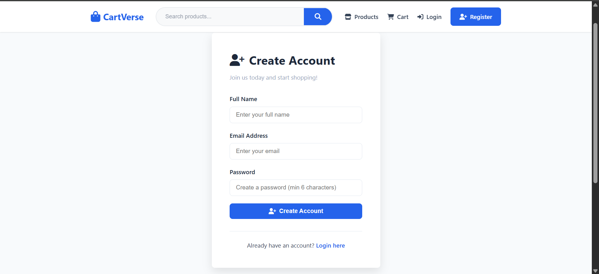
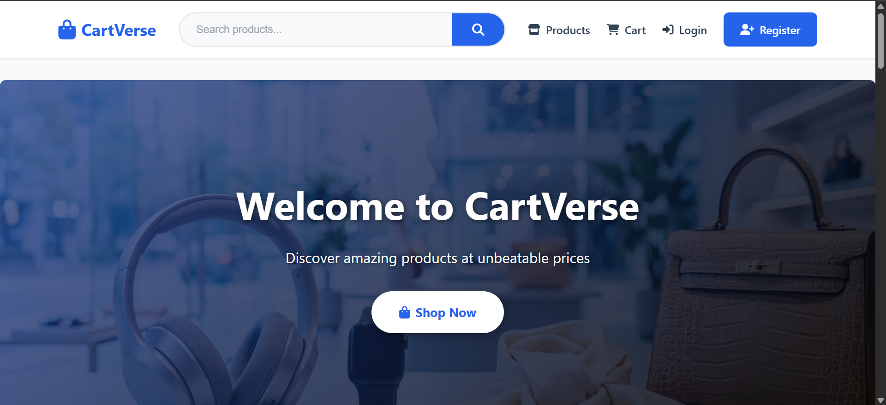
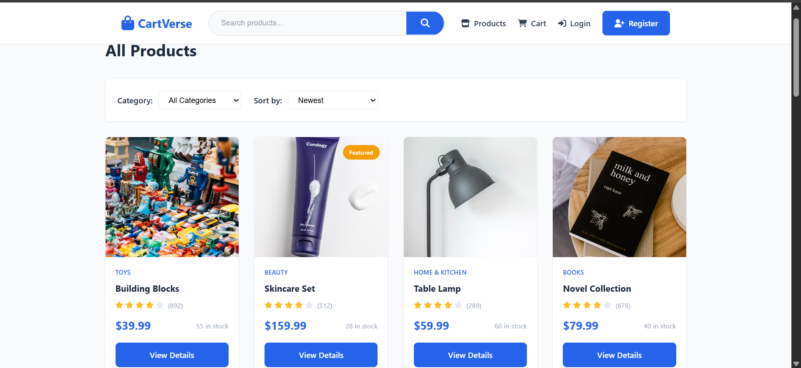
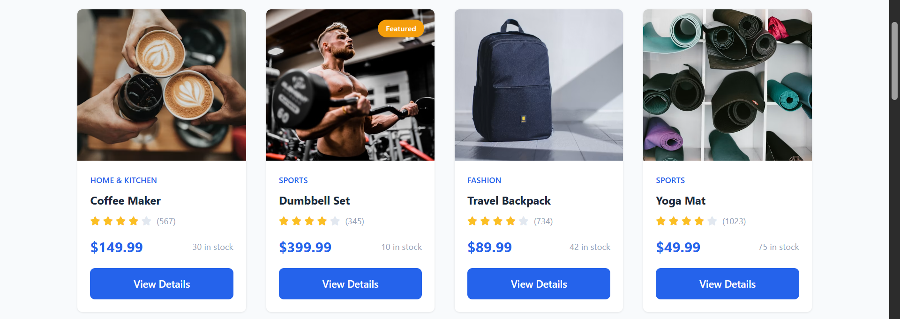
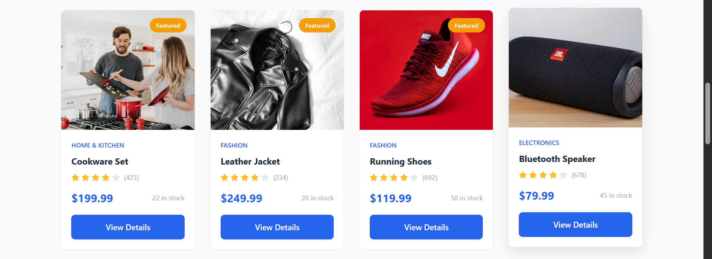
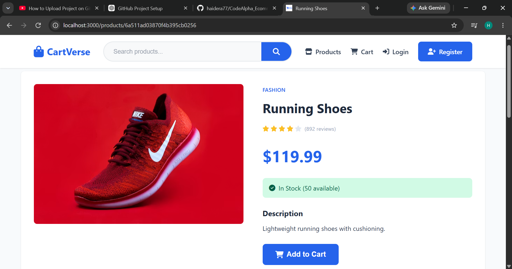
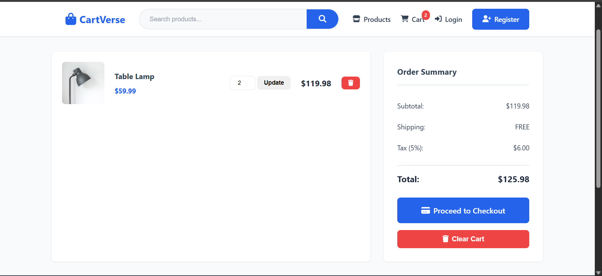

# full stack ecommerce website 
Website Name is:
CartVerse

frontend include : HTML CSS JavaScript
Backend include: Express js Node js and ejs 
and using mongoDB for data base

### website functioality

In this website user can register and login and search products and cart products and track order and view order details.

## Setup

1. Install dependencies:
npm install

2. Create a .env file using .env.example

3. Add your MongoDB connection string

4. Run the project:
npm run dev
## Screenshots

### Register Page

### Home Page

### Products Page

### Cart Page

