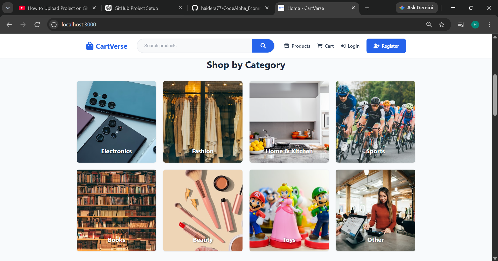
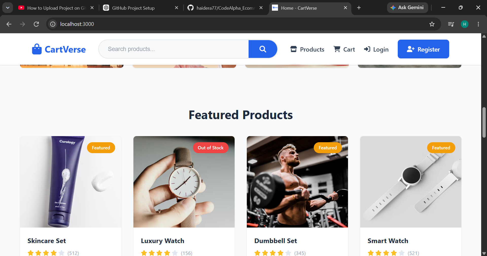
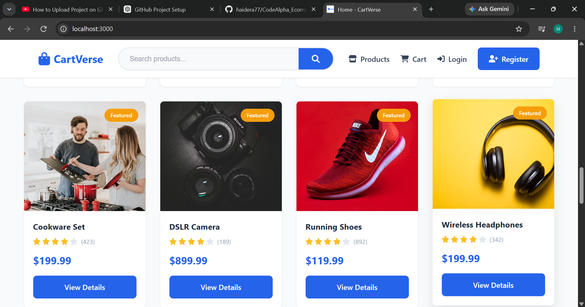

# full stack ecommerce website 
Website Name is
#CartVerse

frontend include : HTML CSS JavaScript
Backend include: Express js Node js and ejs 
and using mongoDB for data base

// website functioality

In this website user can register and login and search products and cart products and track order and view order details.

## Screenshots

### Home Page

### Home category Page

### featured Home Page

### Cart page

